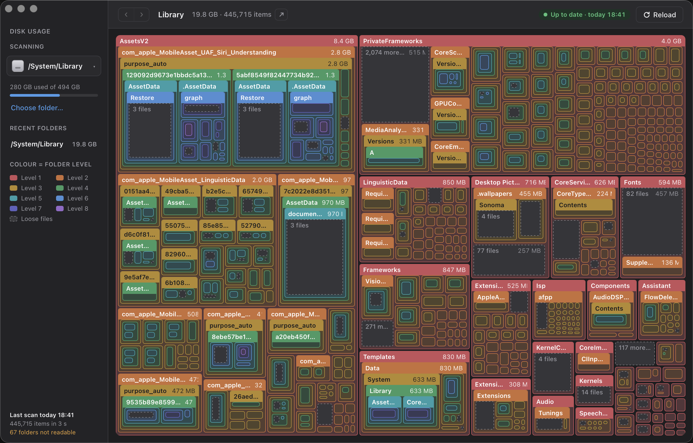

# Disk Usage

A small macOS app that shows what is using the disk: every folder as a block inside its parent's
block, sized by what it takes up, so the big things are big.

Built with Tauri 2, React and Rust.



## What it does

- **Pick a folder**, or take the whole boot volume (the default). The five most recent roots sit in
  the sidebar.
- **Every folder is drawn**, nested, with its name and size where the block is big enough. The
  files sitting directly in a folder are one grey dashed block; folders too small to draw at the
  current zoom are folded into a "more folders" block, so a folder's area is always its total.
- **Colour is nesting level**, in rainbow order: level 1 red, level 2 orange, amber, green, teal,
  blue, indigo, violet. The level is counted from the scan root, so it does not change as you zoom.
- **Cloud folders** (OneDrive, iCloud Drive: anything under `~/Library/CloudStorage` or
  `~/Library/Mobile Documents`) carry a double edge and show two numbers: what is on disk and what
  is in the cloud.
- **Click a block to zoom in**; the breadcrumb, Esc or ⌘↑ take you back up, and the ‹ › buttons
  (⌘[ and ⌘]) step back and forward through where you have been. Hover for the full path, sizes,
  item count and share of the parent.
- **Reveal in Finder**: the arrow on a block's header, ⌘-click on the block, right-click for a menu
  (Reveal in Finder, Zoom in, Copy path, Get Info…), or the arrow beside the breadcrumb for the
  folder on screen. ⌘⇧R does the same.
- **Reload** re-scans (⌘R). While a scan runs the button reads **Stop**; stopping keeps the last
  completed scan on screen. There is no pause.

## Scanning

The scan is a parallel walk in Rust (one task per folder, work-stealing across every core). A full
boot volume of about a million items takes on the order of half a minute on an SSD. It does not
follow symlinks and does not descend into `/System/Volumes` (where the Data volume really lives,
so walking it from `/` would count everything twice), `/Volumes`, `/dev` or the virtual folders.

Sizes are **allocated bytes on disk**, not file lengths, because the question is what is using the
disk. A cloud file that is online-only has a length but no blocks, so it counts as nothing on disk
and shows up only in the folder's "in cloud" figure. So that an online-only OneDrive does not
vanish, a cloud folder's block is never drawn smaller than 2% of its cloud size; inside such a
folder the blocks are then proportional to cloud size, and the tooltip says so.

Every completed scan is **cached** under `~/Library/Application Support/Disk Usage Visualiser/`,
one file per root. On launch the cached map is drawn at once and a fresh scan runs behind it; the
strip under the title bar shows the folder being walked, the items counted so far, and a percentage
measured against the previous scan's count. The menu-bar item carries the volume's used/total and
the same progress line while a scan is on.

The scan total is smaller than the volume's "used" figure in the sidebar: that figure comes from
the filesystem and includes local Time Machine snapshots, purgeable space and folders the walk
skips or cannot read.

Folders the app is not allowed to read are skipped and counted. If any were skipped and the app
does not have Full Disk Access, a banner says so and opens System Settings.

## Install

Apple Silicon Macs, macOS 13 or later. No need to clone anything.

1. **Download** `Disk-Usage-1.1.0-arm64.zip` from the
   [latest release](https://github.com/waynetd777/disk-usage-visualiser/releases/latest).
2. **Unzip it** (double-click) and drag **Disk Usage.app** into your **Applications** folder.
3. **Clear the download flag.** The app is signed with a self-signed certificate rather than an
   Apple Developer ID, so macOS will refuse to open it until you do this once. In Terminal:

   ```bash
   xattr -dr com.apple.quarantine "/Applications/Disk Usage.app"
   ```

   Then open it normally. (Without this you get "Apple could not verify Disk Usage is free of
   malware"; the command only removes the flag macOS puts on downloaded files.)
4. **Give it Full Disk Access** under System Settings → Privacy & Security → Full Disk Access, so
   it can see inside Mail, Safari, Photos and the other protected folders. Without it those folders
   are skipped and a banner in the app says so.

Closing the window hides it; the app stays in the menu bar, and Quit is in that menu.

If you have the GitHub CLI, steps 1–3 are:

```bash
gh release download --repo waynetd777/disk-usage-visualiser --pattern '*.zip' --dir ~/Downloads
ditto -xk ~/Downloads/Disk-Usage-1.1.0-arm64.zip /Applications
xattr -dr com.apple.quarantine "/Applications/Disk Usage.app"
```

### Build it yourself

```bash
git clone https://github.com/waynetd777/disk-usage-visualiser ~/Projects/disk-usage-visualiser
cd ~/Projects/disk-usage-visualiser
npm install
make install-app      # signed build, copied to /Applications
```

## Commands

| Command | What it does |
|---|---|
| `make install-app` | Build the signed app and replace the copy in /Applications |
| `make release-zip` | Build and zip the app as `dist-release/Disk-Usage-<version>-arm64.zip` |
| `make check` | Rust tests and TypeScript type-check |
| `make dev` | App with hot reload (shows as `DiskUsage` in the Dock; the bundle shows `Disk Usage`) |
| `make icons` | Redraw the icon artwork (`tools/make_icons.py`) and regenerate the Tauri icon set |
| `make screenshots` | Recapture `docs/screenshots/app.png` (needs Screen Recording for the terminal) |

## Notes

**Code signing.** macOS ties privacy grants to an app's signature, so an unsigned build would need
Full Disk Access granted again after every rebuild. Builds are signed with a self-signed
certificate in the login keychain rather than an Apple Developer ID. Copy `signing.local.example`
to `signing.local` (untracked) and name your own certificate there; `make app` refuses to build
without it. That is why a downloaded copy needs the one-off `xattr -dr com.apple.quarantine`
above; a build made on the signing machine runs without it.

**Build times.** `src-tauri/Cargo.toml` keeps the lib `rlib`-only and uses thin LTO with parallel
codegen units, which takes an incremental build from minutes to about twenty seconds at the cost of
about a megabyte of binary.

**Startup.** The window appears already painted in the theme colour, with an inline splash until
the cached scan is read. To see the timings:

```bash
DU_TIMING=1 "/Applications/Disk Usage.app/Contents/MacOS/DiskUsage"
```

**Where things live**

| What | Where |
|---|---|
| Cached scans, recent roots, last root | `~/Library/Application Support/Disk Usage Visualiser/` |
| The scanner | `src-tauri/src/scan.rs` |
| The treemap | `src/Treemap.tsx` |
| Icon artwork | `design/icon.png` and `src-tauri/icons/tray@2x.png`, drawn by `tools/make_icons.py` |

## Licence

MIT. See [LICENSE](LICENSE). Use the code for anything, including commercially,
as long as the copyright notice and licence text come along with it.
