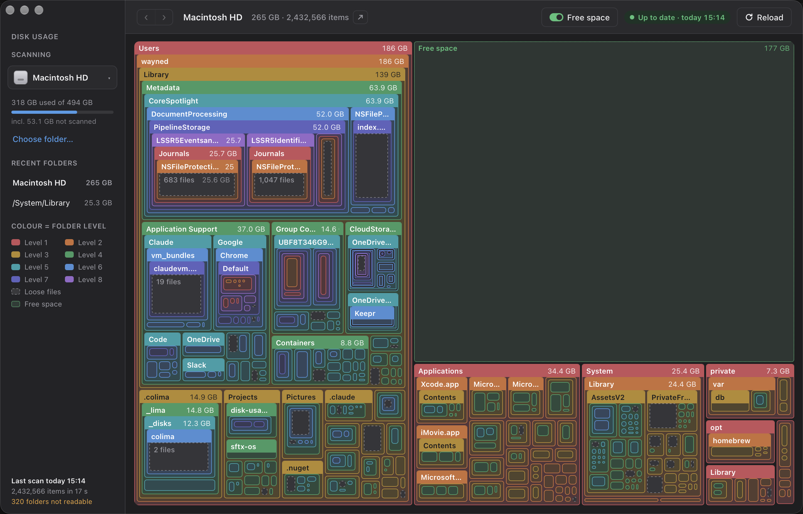

# Disk Usage

A small macOS app that shows what is using the disk: every folder as a block inside its parent's
block, sized by what it takes up, so the big things are big.

Built with Tauri 2, React and Rust.



## What it does

The user guide is [docs/guide.md](docs/guide.md); it is also the app's help (press `?`).

- **Pick a folder**, or take the whole boot volume (the default). The five most recent roots sit in
  the sidebar.
- **Every folder is drawn**, nested, with its name and size where the block is big enough. The
  files sitting directly in a folder are one grey dashed block; folders too small to draw at the
  current zoom are folded into a "more folders" block, so a folder's area is always its total.
- **Free space** is drawn as a dotted green block beside the folders at the top of a whole-disk
  scan (the boot volume, or a disk under `/Volumes`), so the map shows the whole disk. It is on by
  default; the **Free space** switch in the title bar hides it, and the app remembers the choice.
  It is not drawn inside a folder, or for a scan of a single folder.
- **Colour is nesting level**, in rainbow order: level 1 red, level 2 orange, amber, green, teal,
  blue, indigo, violet. The level is counted from the scan root, so it does not change as you zoom.
- **Cloud folders** (OneDrive, iCloud Drive: anything under `~/Library/CloudStorage` or
  `~/Library/Mobile Documents`) carry a double edge and show two numbers: what is on disk and what
  is in the cloud.
- **Click a folder block to zoom in.** Clicking its grey loose-files block opens the same folder.
  The breadcrumb, Esc or ⌘↑ take you back up, and the ‹ › buttons
  (⌘[ and ⌘]) step back and forward through where you have been. Hover for the full path, sizes,
  item count and share of the parent.
- **Browse individual files** in the current folder's files box, which fills the map area when
  the folder contains only files. A Finder-style table lists Name, Date Modified, Size, On Disk
  and Kind. Search by filename using the box at the top, click a column heading to sort, and
  double-click a file or use its arrow to reveal it in Finder. Search covers files directly in
  this folder; it does not search subfolders. A folder with thousands of files loads a page at a
  time as you scroll.
- **Reveal in Finder**: the arrow on a block's header, ⌘-click on the block, right-click for a menu
  (Reveal in Finder, Zoom in, Copy path, Get Info…), or the arrow beside the breadcrumb for the
  folder on screen. ⌘⇧R does the same.
- **Reload** re-scans (⌘R). While a scan runs the button reads **Stop**; stopping keeps the last
  completed scan on screen. There is no pause.
- **Ask** (⌘K) opens a chat about the folder on screen: it puts the scan to an AI and asks where
  space can be reclaimed safely, with suggested questions to start from. It runs through an AI
  command-line tool already installed and signed in on the Mac (Claude Code, Codex, Antigravity or
  GitHub Copilot; no key is set up in the app), the model menu lists every model they offer, and
  each answer has a **Copy** button for pasting as text or formatted text. The AI sees names, paths
  and sizes only, and the app deletes nothing.
- **Help** (`?`) opens the user guide in a drawer beside the map, searchable, with a button to
  hand a question on to Ask.

## Scanning

The scan is a parallel walk in Rust (one task per folder, work-stealing across every core). A full
boot volume of about a million items takes on the order of half a minute on an SSD. It does not
follow symlinks and does not descend into `/System/Volumes` (where the Data volume really lives,
so walking it from `/` would count everything twice), `/Volumes`, `/dev` or the virtual folders.

Sizes are **allocated bytes on disk**, not file lengths, because the question is what is using the
disk. A cloud file that is online-only has a length but no blocks, so it counts as nothing on disk
and shows up only in the folder's "in cloud" figure. So that an online-only OneDrive does not
vanish, a cloud folder's block is never drawn smaller than 2% of its cloud size; inside such a
folder the blocks are then proportional to cloud size, and the tooltip says so.

Every completed scan is **cached** under `~/Library/Application Support/Disk Usage Visualiser/`,
one file per root. On launch the cached map is drawn at once and a fresh scan runs behind it; the
strip under the title bar shows the folder being walked, the items counted so far, and a percentage
measured against the previous scan's count. The menu-bar item carries the volume's used/total and
the same progress line while a scan is on.

The scan total is smaller than the volume's "used" figure in the sidebar: that figure comes from
the filesystem and includes local Time Machine snapshots, purgeable space and folders the walk
skips or cannot read.

The file table reads current file metadata when opened, so it can differ from the last scanned
totals in the map. **Size** is the file's length; **On Disk** is its allocated disk space. Listing
files does not read their contents or download online-only cloud files.

Folders the app is not allowed to read are skipped and counted. If any were skipped and the app
does not have Full Disk Access, a banner says so and opens System Settings.

## Install

Apple Silicon Macs, macOS 13 or later. No need to clone anything.

1. **Download** [Disk-Usage.dmg](https://github.com/waynetd777/disk-usage-visualiser/releases/latest/download/Disk-Usage.dmg)
   from the [latest release](https://github.com/waynetd777/disk-usage-visualiser/releases/latest).
2. **Open it** and drag **Disk Usage** onto **Applications**.
3. **Open Disk Usage** from Applications. macOS says it can't check the app for malicious
   software, because it is signed with a self-signed certificate rather than an Apple Developer ID
   and isn't notarised. Click **Done**, then open System Settings → Privacy & Security, scroll down
   and click **Open Anyway** beside Disk Usage, then **Open Anyway** again and enter your password.
   It opens normally after that.
4. **Give it Full Disk Access** under System Settings → Privacy & Security → Full Disk Access, so
   it can see inside Mail, Safari, Photos and the other protected folders. Without it those folders
   are skipped and a banner in the app says so.

Closing the window hides it; the app stays in the menu bar, and Quit is in that menu.

Instead of step 3 you can clear the download flag in Terminal, which is all Open Anyway does:

```bash
xattr -dr com.apple.quarantine "/Applications/Disk Usage.app"
```

### Build it yourself

```bash
git clone https://github.com/waynetd777/disk-usage-visualiser ~/Projects/disk-usage-visualiser
cd ~/Projects/disk-usage-visualiser
npm install
make install-app      # signed build, copied to /Applications
```

## Commands

| Command | What it does |
|---|---|
| `make install-app` | Build the signed app and replace the copy in /Applications |
| `make dmg` | Build the app and pack it into the installer, `dist-release/Disk-Usage.dmg` |
| `make check` | Lint, Rust tests and TypeScript type-check |
| `make lint` | rustfmt and clippy for the Rust, ESLint and Prettier for the TypeScript; fails on any warning |
| `make fmt` | Reformat the Rust and TypeScript in place |
| `make dev` | App with hot reload (shows as `DiskUsage` in the Dock; the bundle shows `Disk Usage`) |
| `make icons` | Redraw the icon artwork (`tools/make_icons.py`) and regenerate the Tauri icon set |
| `make screenshots` | Recapture `docs/screenshots/app.png` (needs Screen Recording for the terminal) |

## Notes

**Code signing.** macOS ties privacy grants to an app's signature, so an unsigned build would need
Full Disk Access granted again after every rebuild. Builds are signed with a self-signed
certificate in the login keychain rather than an Apple Developer ID. Copy `signing.local.example`
to `signing.local` (untracked) and name your own certificate there; `make app` refuses to build
without it. That is why a downloaded copy needs Open Anyway (or `xattr -dr com.apple.quarantine`)
once; a build made on the signing machine runs without it.

**Releasing.** Bump the version in `src-tauri/tauri.conf.json`, `src-tauri/Cargo.toml` and
`package.json`, run `make dmg`, commit and push, then
`gh release create v<version> dist-release/Disk-Usage.dmg`. The download link above points at the
latest release's `Disk-Usage.dmg`, so keep that name. `tools/dmg/make_dmg.py` renders the window's
background from `tools/dmg/background.html` with WebKit and has Finder lay out the icons, so the
first run asks to let the terminal control Finder.

**Build times.** `src-tauri/Cargo.toml` keeps the lib `rlib`-only and uses thin LTO with parallel
codegen units, which takes an incremental build from minutes to about twenty seconds at the cost of
about a megabyte of binary.

**Startup.** The window appears already painted in the theme colour, with an inline splash until
the cached scan is read. To see the timings:

```bash
DU_TIMING=1 "/Applications/Disk Usage.app/Contents/MacOS/DiskUsage"
```

**Where things live**

| What | Where |
|---|---|
| Cached scans, recent roots, last root | `~/Library/Application Support/Disk Usage Visualiser/` |
| The scanner | `src-tauri/src/scan.rs` |
| The treemap | `src/Treemap.tsx` |
| The searchable file table | `src/FileTable.tsx` |
| File metadata listing | `src-tauri/src/files.rs` |
| Installer layout | `tools/dmg/` (`background.html` is the window's background) |
| Icon artwork | `design/icon.png` and `src-tauri/icons/tray@2x.png`, drawn by `tools/make_icons.py` |

## Licence

MIT. See [LICENSE](LICENSE). Use the code for anything, including commercially,
as long as the copyright notice and licence text come along with it.
